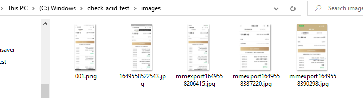
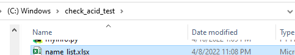
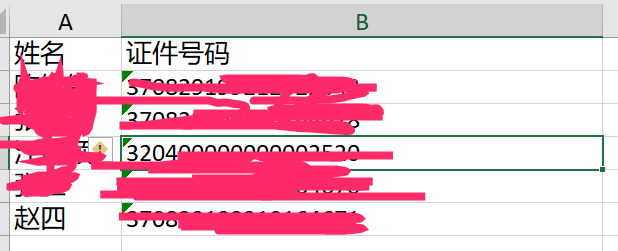
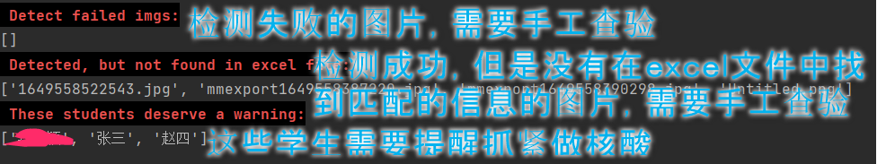
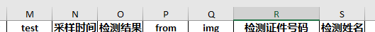
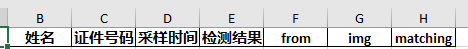
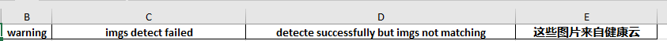
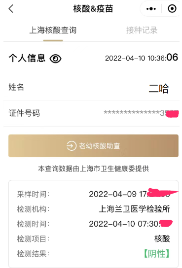

#说明
从2022年3月开始，上海经历了奥密克戎的袭击。在大学校老师的工作负担也直线上升，其中有一项工作是收集所有学生的核酸检查结果，手工统计非常耗费精力。白天要尽力服务学院几百位学生，晚上还学处理这些耗费精力的事情。

老师们的身体渐渐吃不消。

作为一名老师家属，当得知还有这种统计工作，首先想到的是为什么随申办（从2022年04月09日起切换为随申办核酸码）的开发者，不开发这样的功能？竟让广大基层工作者浪费如此大量的人力物力去做统计工作。 真的希望负责研发随申办的人员能主动听一听基层人员的建议或苦衷。那才是我们不断创新、进步的源泉。

但是，我的力量有限，只能“将计就计”，那就利用现有paddleocr的中文识别技术去识别所有同学的截图来一定程度的自动化统计。

希望这个简单的程序能缓解基层工作人员的压力，也希望开发者能主动收集建议，而不是闭门造车。

运行时间：~s/picture

程序不可避免存在bug，且程序也仅仅是为了尽快解决问题，肯定有考虑欠妥的地方，欢迎评论。

所解析的随申办截图格式见文末

# 安装
```
git clone https://github.com/dahaiyidi/check_acid_test.git
cd check_acid_test
conda create -name ocr
conda activate ocr
conda install python==3.8
pip install -r requirements.txt
```

# 数据准备

* 放置所有的照片在images文件夹中，如：

* 放置学生信息统计表name_list.xlsx，如

文件中也可以不包含证件号码信息，此时则无法处理重名的情况，需手工查验的需求增加


* 在check_acid_test 目录中运行命令
```
python main_ssb.py
```
你也可以指定图片文件夹和name_list.xlsx位置

```
python main_ssb.py --names C:\check_acid_test\backup\name_list.xlsx --images C:\check_acid_test\backup\images
```

得到结果：



* 同一目录下，会多出一个```name_list_{当前时间}.xlsx```的文件

在该文件的overview sheet中，会多出4列，test列记录了学生是否已经做核酸（1是做了核酸），img列记录了与该学生匹配的图片名字，其他3列根据列名即可知晓含义。



在img_detection_res sheet中，存储了图片检测结果， matching列，1代表了与输入的name_list.xlsx名单信息能匹配上。



在warning sheet中的3列分别记录了：需要提醒做核酸的同学名单，检测失败的图片名单（需要手工查验），检测成功但是与名单不符合的图片名单（需要手工查验）。


# 所解析的随申办截图格式

